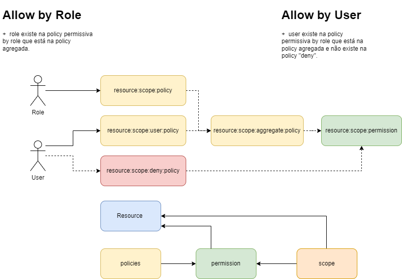
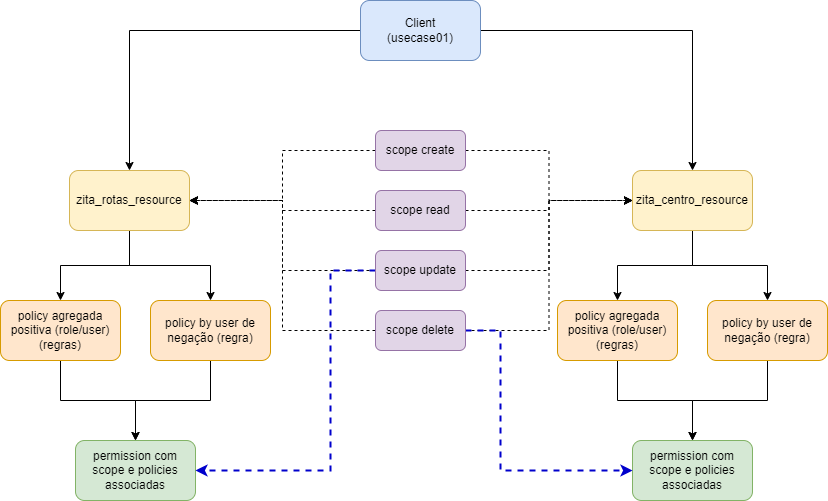

# Keycloak README

## Keycloak container image
```console
https://quay.io/repository/keycloak/keycloak
````

## Endpoints
- Admin painel
```console
http://192.168.2.88:8088/admin
```
- End-user realm painel
```console
http://192.168.2.88:8088/realms/<realm-name>/account
```

# Âmbito
O projeto tem como propósito utilizar o Keycloak para autorizar e autenticar utilizadores.
Esta autenticação será feita *by User* enquanto as autorizações devem chegar a um nível
onde possam ser associadas *by Role* ou *by User*. De forma que as autorizações *by User* 
sobreponham as autorizações *by Role*.

## Estruturas Keycloak para autorizações
- Resource
- Scope
- Policy
- Permission

*Para maiores informações, consute a base de conhecimento*.

## Estratégia
Para garantir as necessidades do projeto: 

- Permissões individuais por scopes
- Permissões definidas por Roles
- Permissões definidas por Utilizador
- Permissões definidas por Utilizador sobrepõem as definidas na Role

Foi definida uma estrutura onde:

- Todas as permissions criadas serão by Scope; ou seja, protegem um único scope (1:1).
- Será criada uma policy *by Role* com lógica **positiva**.
- Será criada uma policy *by User* com lógica **positiva**.
- Será criada uma policy agregadora que irá agregar as duas policies positivas criadas com lógica 
**positiva** e estratégia **afirmativa**.
- Será criada uma policy *by User* com lógica **negativa**.
- A policy agregadora e negativa serão associadas a respetiva permission.



### Policies
A policy de agregação tem como objetivo garantir que um utilizador autorizado pela Role ou por si aceda 
ao respetivo scope, a estratégia **afirmativa** garante isso. Já a policy **negativa** irá 
garantir que o utilizador contido nela não aceda ao scope protegido. Isso será mais a frente explicado 
quando falarmos das permissions.

### Permissions
A permission irá proteger exclusivamente um scope (1:1) e terá associada a policy negativa e agregada. 
A decisão da permissão será sempre **por unanimidade**, pois uma vez que a policy negativa seja verdadeira 
o acesso será negado. Por sua vez a policy agregada dá resposta a necessidade do projeto de permitir individualmente
um utilizado, ou garantir sua permissão através das roles (processo mais comum).



*Imagem exemplifica a criação e associação dos recursos KeyCloak*.

## Knowledge base
- [Getting started with Docker](https://www.keycloak.org/getting-started/getting-started-docker)
- [Keycloak API Doc](https://www.keycloak.org/docs-api/21.0.1/rest-api/index.html#_overview)
- [Keycloadk API Postman Lib v18.0](https://documenter.getpostman.com/view/7294517/SzmfZHnd#intro)
- [Keycloak disable TLS(self-hosted CA problem)](https://groups.google.com/g/keycloak-user/c/H95eYsbhVHg)